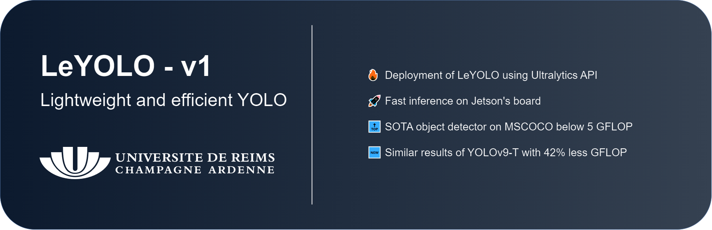
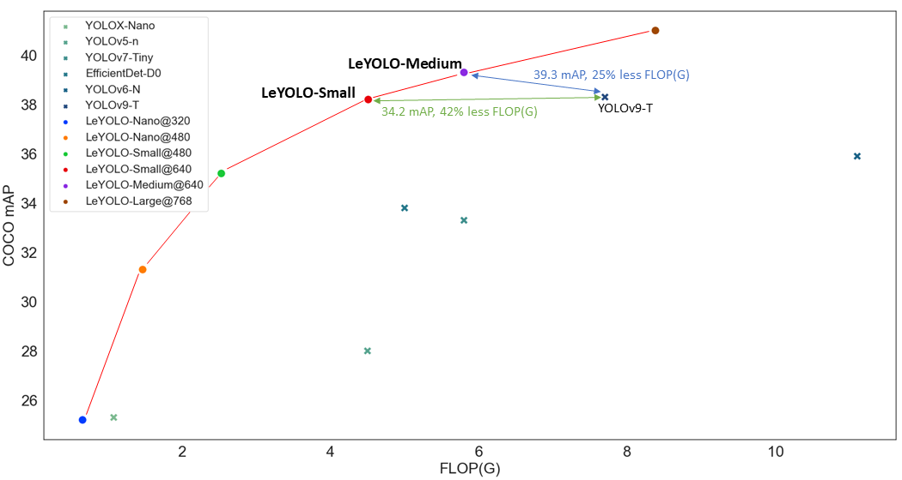

# Abstract
-> Read paper : (arXiv link)




<p align="justify">Computational efficiency in deep neural networks is critical for object detection, especially as newer models prioritize speed over efficient computation (FLOP). This evolution has somewhat left behind embedded and mobile-oriented AI object detection applications. In this paper, we focus on design choices of neural network architectures for efficient object detection computation based on FLOP and propose several optimizations to enhance the efficiency of YOLO-based models.</p>

<p align="justify">Firstly, we introduce an efficient backbone scaling inspired by inverted bottlenecks and theoretical insights from the Information Bottleneck principle. Secondly, we present the Fast Pyramidal Architecture Network (FPAN), designed to facilitate fast multiscale feature sharing while reducing computational resources. Lastly, we propose a Decoupled Network-in-Network (DNiN) detection head engineered to deliver rapid yet lightweight computations for classification and regression tasks.</p>

<p align="justify">Building upon these optimizations and leveraging more efficient backbones, this paper contributes to a new scaling paradigm for object detection and YOLO-centric models called LeYOLO. Our contribution consistently outperforms existing models in various resource constraints, achieving unprecedented accuracy and flop ratio. Notably, LeYOLO-Small achieves a competitive mAP score of 38.2% on the COCO val with just 4.5 FLOP(G), representing a 42% reduction in computational load compared to the latest state-of-the-art YOLOv9-Tiny model while achieving similar accuracy. Our novel model family achieves a FLOP-to-accuracy ratio previously unattained, offering scalability that spans from ultra-low neural network configurations (< 1 GFLOP) to efficient yet demanding object detection setups (> 4 GFLOPs) with 25.2, 31.3, 35.2, 38.2, 39.3 and 41 mAP for 0.66, 1.47, 2.53, 4.51, 5.8 and 8.4 FLOP(G).</p>


# LeYOLO Results

<p align="justify">LeYOLO family model results on MSCOCO val dataset. 
Find pre-trained weights in the weights folder.</p>


<p align="center">

| Models           | mAP | Image Size     | FLOP (G) |
|------------------|-----|----------------|----------|
|LeYOLONano        |25.2 | 320            | 0.66     |
|LeYOLONano        |31.3 | 480            | 1.47     |
|LeYOLOSmall       |35.2 | 480            | 2.53     |
|LeYOLOSmall       |38.2 | 640            | 4.51     |
|LeYOLOMedium      |39.3 | 640            | 5.80     |
|LeYOLOLarge       |41.0 | 768            | 8.40     |

</p>

## Reproductability


<p align="justify">
Reproduce LeYOLO results by using a cfg file.
We did not use expansive or fancy training methods, just classic and default Ultralytics training recipes.
We enable non-computer scientist to perform fast training reproducibility for their research with effortless training methods!
</p>

# LeYOLO installation and quickstart

## Install
- Warning ! Upgrading pip might be necessary 
	```
	python3 -m pip install --upgrade pip
	```
- Go into root folder
	```
	pip install -e .
	```

## Quickstart
Use CLI or python interface to use LeYOLO / YOLOv8

- Minimal example can be found in minimal.ipynb notebook.

### Python

```Python
from ultralytics import YOLO

#Load LeYOLO model
model = YOLO("weights/LeYOLOSmall.pt")

#Use Ultralytics grounding computer vision methods
model.train(data="coco8.yaml", epochs=3)
model.val()
model.export(format="onnx")
```


# Special thanks

<p align="justify">
We could only have accomplished this with the excellent work from the Ultralytics team since YOLOv5. LeYOLO fully integrates with Ultralytics, and their support and documentation comprehensively guide training, inference, validation, and export mechanisms.
</p>
<p align="justify">
For more details, refer to the Ultralytics documentation: https://www.ultralytics.com.
</p>


# Contacts
Any questions or remarks? Contact lilian.hollard@univ-reims.fr

> Université de Reims Champagne-Ardenne - CEA, LRC DIGIT, LICIIS
>
> UFR Sciences Exactes et Naturelles - Campus Moulin de la Housse
BP 1039 - 51687 Reims Cedex 2 - Bat 2/3 - France
https://www.univ-reims.fr
